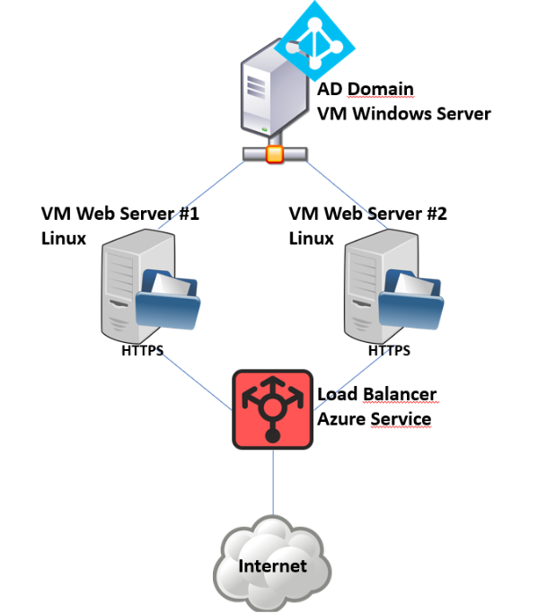

---

# Parte 1: Sitio Web Seguro con Autenticación AD y Balanceo de Carga en Azure

---

## Integrantes

| Nombre                      | Cédula |
|-----------------------------|-----------|
| Dylan Elizondo Alvarado     | 504610652 |
| Luis David Salgado Gámez    | 208670670 |
| Andrea Orozco Sanabría      | 119160751 |
| Kate Guillen Oreamuno       | 20820896  |

---

## Topología de Arquitectura

## Introducción  
En esta primera fase construiremos un entorno de nube seguro que combine autenticación centralizada con Active Directory y balanceo de carga para garantizar alta disponibilidad y protección de tu sitio web. Usaremos Azure como plataforma principal, aprovechando tanto máquinas virtuales Linux para el servicio web como Windows Server para el directorio.

---

## Descripción del proyecto  
El objetivo es desplegar un sitio web dinámico que:

1. **Proteja el acceso** mediante autenticación contra un servicio de Active Directory.  
2. **Garantice disponibilidad** repartiendo el tráfico entrante entre dos instancias idénticas del servidor web.  
3. **Use sólo conexiones seguras (HTTPS)** gracias a certificados digitales emitidos por una autoridad de confianza.  
4. **Se ejecute íntegramente en la nube de Azure**, aprovechando sus servicios de VM, red y balanceo.

---

## Características principales  
- **Autenticación AD**  
  - Un único punto de verdad para usuarios y contraseñas.  
  - Integración transparente con el formulario de login de la web.

- **Balanceo de carga**  
  - Distribuye solicitudes HTTPS entre dos servidores NGINX+PHP.  
  - Mejora la tolerancia a fallos y la escalabilidad horizontal.

- **Comunicación segura**  
  - Certificados TLS/SSL instalados en los servidores web.  
  - Redirección forzada de HTTP a HTTPS para evitar conexiones inseguras.

- **Infraestructura en Azure**  
  - Máquinas virtuales Linux para la capa web.  
  - Una máquina Windows Server 2016 para Active Directory.  
  - Load Balancer gratuito de Azure Networking.

---

## Aspectos relevantes y consideraciones  
- **Seguridad en la nube**:  
  - Sólo exponer los puertos estrictamente necesarios (SSH, RDP, HTTPS).  
  - Uso de grupos de seguridad y firewall para restringir accesos.

- **Alta disponibilidad**:  
  - Duplicar la capa web reduce puntos únicos de fallo.  
  - El balanceador puede detectar instancias caídas y reenviar tráfico.

- **Gestión centralizada de usuarios**:  
  - Con AD puedes añadir, eliminar o modificar usuarios en un solo lugar.  
  - Facilita el cumplimiento de políticas corporativas de identidad.

- **Certificados y DNS**:  
  - Usar un nombre de dominio o alias DNS facilita la validación TLS.  
  - Puedes optar por PKI interna o Let’s Encrypt según tu necesidad.
